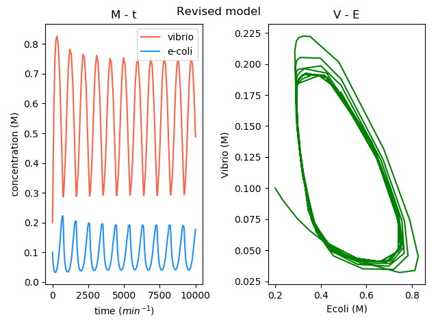
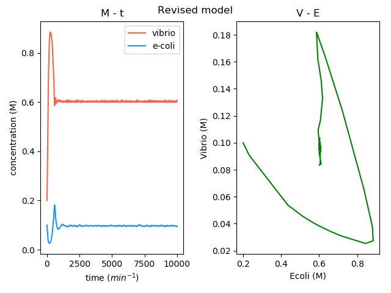

# Model
Modeling project of 2018 iGEM NTHU_Taiwan

## Installation
```
git clone https://github.com/igem-tw-nthu/model.git

pip3 install -r requirements.txt
```

## Note
Because of you can not use mathjax in github README, and there is some display error in github showing .ipynb file. If you want to read it properly or do any change please follow the installation it and run ``` jupyter notebook```.


## Descritpion
See [model.ipynb](model.ipynb)


Oscillating solution



Convergence soltion

